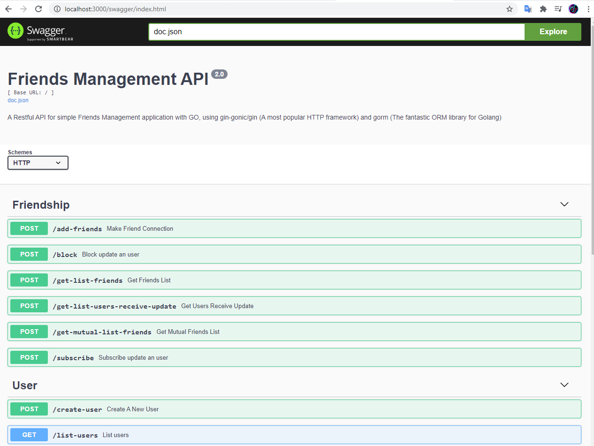
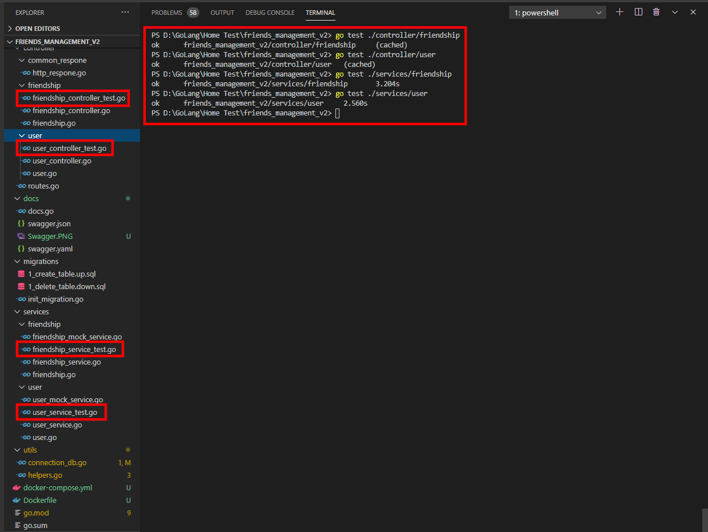

# GO Friends Management REST API
A Restful API for simple Friends Management application with GO, using **gin-gonic/gin** (A most popular HTTP framework) and **gorm** (The fantastic ORM library for Golang)

## Structure

```bash
friends_management_v2                   
├─ api                                  
├─ controller                           
│  ├─ common_respone                    
│  │  └─ http_respone.go                
│  ├─ friendship                        
│  │  ├─ friendship.go                  
│  │  ├─ friendship_controller.go       
│  │  └─ friendship_controller_test.go  
│  ├─ user                              
│  │  ├─ user.go                        
│  │  ├─ user_controller.go             
│  │  └─ user_controller_test.go        
│  └─ routes.go                         
├─ docs                                 
│  ├─ docs.go                           
│  ├─ swagger.json                      
│  ├─ Swagger.PNG                       
│  ├─ swagger.yaml                      
│  └─ UnitTest.PNG                      
├─ migrations                           
│  ├─ 1_create_table.up.sql             
│  ├─ 1_delete_table.down.sql           
│  └─ init_migration.go                 
├─ services                             
│  ├─ friendship                        
│  │  ├─ friendship.go                  
│  │  ├─ friendship_mock_service.go     
│  │  ├─ friendship_service.go          
│  │  └─ friendship_service_test.go     
│  └─ user                              
│     ├─ user.go                        
│     ├─ user_mock_service.go           
│     ├─ user_service.go                
│     └─ user_service_test.go           
├─ utils                                
│  ├─ connection_db.go                  
│  └─ helpers.go                        
├─ docker-compose.yml                   
├─ Dockerfile                           
├─ go.mod                               
├─ go.sum                               
├─ main.go                              
├─ readme.md                            
└─ swagger.sh                           

```

## Installation & Run
```go
host     := "db"
port     := 5432
user     := "postgres"
password := "postgres"
dbname   := "friend-mgmt"
```

For run docker-compose, run these following commands in project's root folder:

```bash
docker-compose build
docker-compose up
```

#### API Endpoint
```bash
http://localhost:3000/swagger/index.html
```

## API Documentation
This is API self documentation by using Swagger. You can test all of them by expand specific api then click on try it out button.



## Test Coverage
All APIs have been tested carefully by mocking strategy. 


---
**NOTE**

You have to change host name in file ***utils/connection_db.go*** to ***localhost*** if you run test

---


## Achievement

- [x] Write the tests for all APIs.
- [x] Organize the code with packages
- [x] Make docs with Swagger
- [x] Building a deployment process 